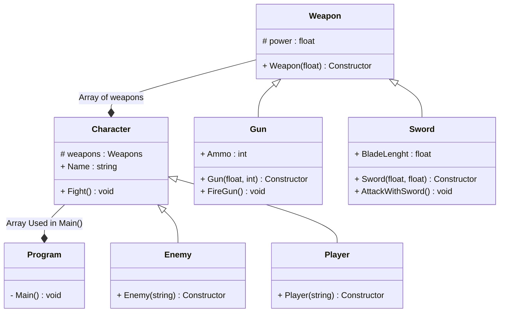

# UML Diagram : MiniGame

```mermaid

classDiagram

    Character --* Program : Array Used in Main()
    Weapon --* Character : Array of weapons
    
    Character <|-- Enemy
    Character <|-- Player
    Weapon <|-- Gun
    Weapon <|-- Sword

    class Program{
       - Main() void
    }

    class Character{
        # weapons : Weapons
        + Name : string
        + Fight() void
    }

    class Player{
        + Player(string) Constructor
    }

    class Enemy{
        + Enemy(string) Constructor
    }

    class Weapon{
        # power : float
        + Weapon(float) Constructor
    }

    class Sword{
        + BladeLenght : float
        + Sword(float, float) Constructor
        + AttackWithSword() void
    }

    class Gun{
        + Ammo : int
        + Gun(float, int) Constructor
        + FireGun() void
    }
```
- Diogo Freire 22104684
#
